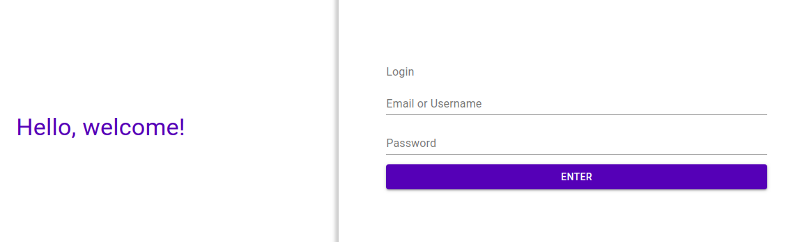
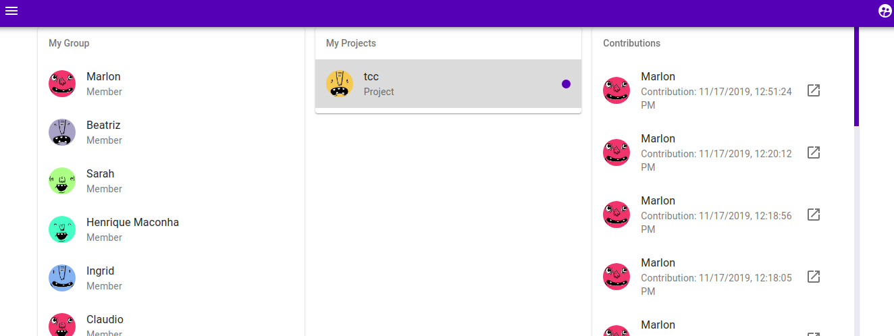
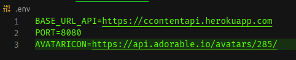

# Nome do produto
> Sistema para gestão de conteudos

Tive a idéia da realização desse projeto, como uma necessidade no sistema que eu estava desenvolvendo para o meu tcc. Basicamente o sistema o sistema apelidade de "Jestent" kk, vai separar o conteudo criado seja para um site de notícias ou qualquer aplicação que necessite da criação de conteudos não esticos e dinâmicos para o seu sistema, todas os dados criados dentro do jestent vai ser armazenado em uma api que você poderá fazer a requisição tranquilamente a esses mesmos dados mais tarde na sua aplicação principal. Apenas outro ponto o jestent funciona por meio de projetos podendo, criar quantos projetos a sua necessidade.




## Configuração para Desenvolvimento

É bem simples a configuração em ambiente de desenvolvimento

```sh
npm install
```

## .Env

> O Projeto ultiliza alguns valores por meio do env



[Projeto da api no GitHub](https://github.com/MarlonFrancisco/Api-rest-mongo-Typescript-JWT)

## Meta

Marlon Francisco – [@Marlon Francisco](https://www.linkedin.com/in/marlon-francisco-a8ab2215b/) – marlon.nascimento2@etec.sp.gov.br

[https://github.com/MarlonFrancisco](https://github.com/MarlonFrancisco)

## Contributing

1. Faça o _fork_ do projeto (<https://github.com/MarlonFrancisco/CMS>)
2. Crie uma _branch_ para sua modificação (`git checkout -b feature/fooBar`)
3. Faça o _commit_ (`git commit -am 'Add some fooBar'`)
4. _Push_ (`git push origin feature/fooBar`)
5. Crie um novo _Pull Request_